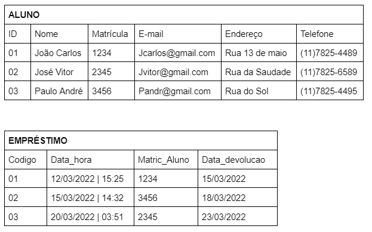
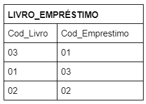

# Code Pack 06 -  Banco de Dados I

## INSTRUÇÕES DO PROJETO

De acordo com os comandos aprendidos, programe códigos SQL para criar um banco de dados chamado ESCOLA e deixe-o pronto para o uso. Depois, pesquise qual é o comando utilizado para inserir uma tabela no banco de dados e siga as instruções:

1. crie uma tabela chamada ALUNO;  
2. defina os atributos da tabela;
3. adicione a chave primária de nome ID (identificador);
4. adicione um atributo nome do tipo varchar;
5. adicione um atributo e-mail do tipo varchar;
6. adicione um atributo endereço do tipo varchar.

Extra: Implementar o SQL para o banco de dados seguindo as tabelas:

